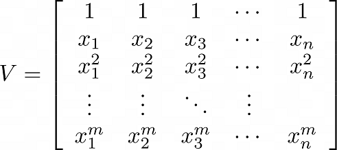

# Fast Analytical-Form Inverse of Vandermonde Matrix

##  Introduction
`invvander` inverses an m-by-n Vandermonde matrix:



Its syntax is similar to the Octave/MATLAB built-in function `vander`.

`invvander` computes the analytic-form inverse of any square Vandermonde matrix in 5.5n^2 floating point operations (flops). `invvander` introduces significantly less rounding errors because it avoids numerical matrix inversion (Vandemonde matrices are usually ill-conditioned). Moreover, `invvander` might be the fastest algorithm so far because is faster than Parker's algorithm that requires 6n^2 flops [1].

Given that [x1,x2,...x11] `=1:0.5:6`, running **Example 3** below in Octave shows  that `invvander` is 150.86 times more accurate and 40.93 times faster than `inv`.

## Algorithms
The algorithm calculates the analytic-form inverse of a square Vandermonde matrix. It is implemented
based on a draft as well as C codes I developed: https://github.com/yveschris/possibly-the-fastest-analytic-form-inverse-vandermonde-matrix 

The algorithm of the calculating the pseudoinverse of a rectangular Vandermonde matrix is standard. It  implemented based on the QR decomposition, followed by a forward and a back substitutions. 

## Syntax and Function Description

B = invvander(v) returns the inverse of a square Vandermonde Matrix, i.e., m = n for the above matrix V. v has to be a row vector and v = [x1, x2, ..., xn].

B = invvander(v, m) returns the pseudoinverse of an m-by-n rectangular Vandermonde Matrix. v has to be a row vector and v = [x1, x2, ..., xn] while m has to be a scalar and positive integer of the above matrix V. If m equals the number of v, then B is the inversed square Vandermonder matrix. 

## Examples

### Example 1: inverse of an n-by-n square Vandermonde matrix:
```matlab
v = 1:.5:6;
B = invvander(v);
```

### Example 2: pseudoinverse of an m-by-n rectangular Vandermonde matrix:
```matlab
v = 1:.5:6;
B = invvander(v, 20);
```

###  Example 3: Error reduction and runtime improvement testing when dealing with a square Vandermonde matrix:
```matlab
v = 1:.5:6;
A = vanderm(v);

e1 = norm(A - inv(inv(A)), 2);
e2 = norm(A - inv(invvander(v)), 2);
disp(['e1/e2 = ' num2str(e1 / e2)]);
% Octave Output: e1/e2 = 150.8606

tic
invvander(v);
t1 = toc
tic
inv(A);
t2 = toc
disp(['t1/t2 = ' num2str(t1 / t2)]);
% Octave Output: t1/t2 = 40.9325
```


## References

1. F. Parker, Inverses of Vandermonde matrices, Amer. Math. Monthly 71,410-411, (1964).
